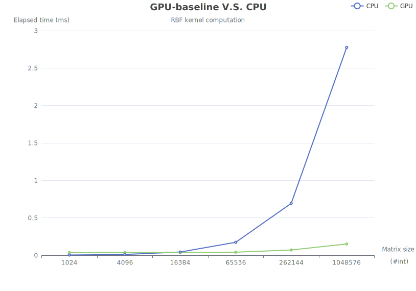
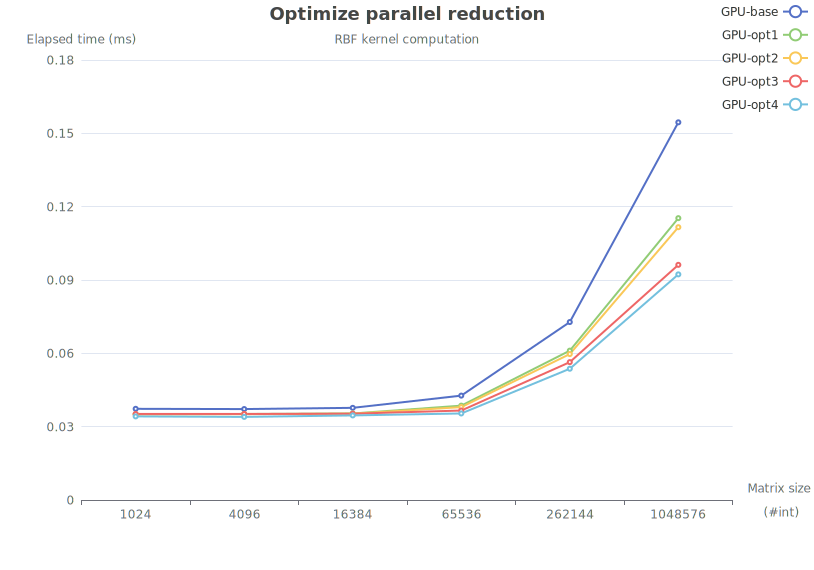
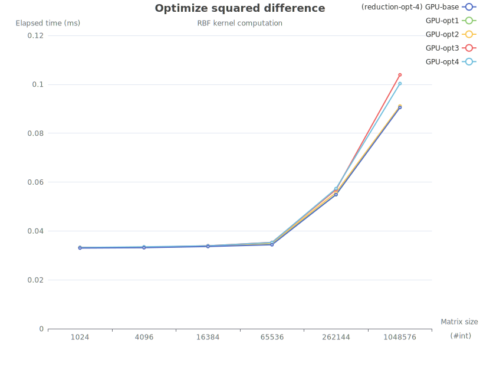

# Experimental Results
## Context
* Intel Xeon E5-2678 v3 (#24)
* GeForce GTX 1080 Ti (#3)
* CUDA version 9.0
## 1. GPU-baseline V.S. CPU
* compile and run `rbf0_baseline.cu`
```shell
>> make baseline
>> ./rbf0_baseline.out
```
* console output
```
# Matrix size: 1024
CPU elapsed time: 0.003300 ms
GPU elapsed time: 0.035700 ms

# Matrix size: 4096
CPU elapsed time: 0.010900 ms
GPU elapsed time: 0.035700 ms

# Matrix size: 16384
CPU elapsed time: 0.043400 ms
GPU elapsed time: 0.036300 ms

# Matrix size: 65536
CPU elapsed time: 0.173400 ms
GPU elapsed time: 0.041400 ms

# Matrix size: 262144
CPU elapsed time: 0.693100 ms
GPU elapsed time: 0.070700 ms

# Matrix size: 1048576
CPU elapsed time: 2.775500 ms
GPU elapsed time: 0.150900 ms
```



## 2. Optimize parallel reduction
* optimize based on the baseline
* compile and run `rbf1_opt_reduction.cu`
```shell
>> make opt_reduction
>> ./rbf1_opt_reduction.out
```
* console output
```
# Matrix size: 1024
GPU (base) elapsed time: 0.037300 ms
GPU (opt1) elapsed time: 0.035100 ms
GPU (opt2) elapsed time: 0.035000 ms
GPU (opt3) elapsed time: 0.035200 ms
GPU (opt4) elapsed time: 0.034200 ms

# Matrix size: 4096
GPU (base) elapsed time: 0.037200 ms
GPU (opt1) elapsed time: 0.035200 ms
GPU (opt2) elapsed time: 0.035100 ms
GPU (opt3) elapsed time: 0.035200 ms
GPU (opt4) elapsed time: 0.034000 ms

# Matrix size: 16384
GPU (base) elapsed time: 0.037700 ms
GPU (opt1) elapsed time: 0.035400 ms
GPU (opt2) elapsed time: 0.035300 ms
GPU (opt3) elapsed time: 0.035300 ms
GPU (opt4) elapsed time: 0.034600 ms

# Matrix size: 65536
GPU (base) elapsed time: 0.042700 ms
GPU (opt1) elapsed time: 0.038600 ms
GPU (opt2) elapsed time: 0.038000 ms
GPU (opt3) elapsed time: 0.036600 ms
GPU (opt4) elapsed time: 0.035400 ms

# Matrix size: 262144
GPU (base) elapsed time: 0.072800 ms
GPU (opt1) elapsed time: 0.061100 ms
GPU (opt2) elapsed time: 0.059700 ms
GPU (opt3) elapsed time: 0.056400 ms
GPU (opt4) elapsed time: 0.053700 ms

# Matrix size: 1048576
GPU (base) elapsed time: 0.154500 ms
GPU (opt1) elapsed time: 0.115300 ms
GPU (opt2) elapsed time: 0.111600 ms
GPU (opt3) elapsed time: 0.096200 ms
GPU (opt4) elapsed time: 0.092300 ms
```



## 3. Optimize squared difference
* optimize based on the reduction-optimized version (opt4)
* compile and run `rbf2_opt_squareddif.cu`
```shell
>> make opt_squareddif
>> ./rbf2_opt_squareddif.out
```
* console output
```
# Matrix size: 1024
GPU (base) elapsed time: 0.032980 ms
GPU (opt1) elapsed time: 0.033220 ms
GPU (opt2) elapsed time: 0.033200 ms
GPU (opt3) elapsed time: 0.033220 ms
GPU (opt4) elapsed time: 0.033240 ms

# Matrix size: 4096
GPU (base) elapsed time: 0.033140 ms
GPU (opt1) elapsed time: 0.033300 ms
GPU (opt2) elapsed time: 0.033380 ms
GPU (opt3) elapsed time: 0.033240 ms
GPU (opt4) elapsed time: 0.033500 ms

# Matrix size: 16384
GPU (base) elapsed time: 0.033620 ms
GPU (opt1) elapsed time: 0.033700 ms
GPU (opt2) elapsed time: 0.033740 ms
GPU (opt3) elapsed time: 0.033940 ms
GPU (opt4) elapsed time: 0.033920 ms

# Matrix size: 65536
GPU (base) elapsed time: 0.034340 ms
GPU (opt1) elapsed time: 0.034900 ms
GPU (opt2) elapsed time: 0.035000 ms
GPU (opt3) elapsed time: 0.035320 ms
GPU (opt4) elapsed time: 0.035280 ms

# Matrix size: 262144
GPU (base) elapsed time: 0.054880 ms
GPU (opt1) elapsed time: 0.054800 ms
GPU (opt2) elapsed time: 0.055720 ms
GPU (opt3) elapsed time: 0.056880 ms
GPU (opt4) elapsed time: 0.057320 ms

# Matrix size: 1048576
GPU (base) elapsed time: 0.090500 ms
GPU (opt1) elapsed time: 0.091020 ms
GPU (opt2) elapsed time: 0.091100 ms
GPU (opt3) elapsed time: 0.103880 ms
GPU (opt4) elapsed time: 0.100320 ms
```
* And the optimization result is not so good ... 😭

